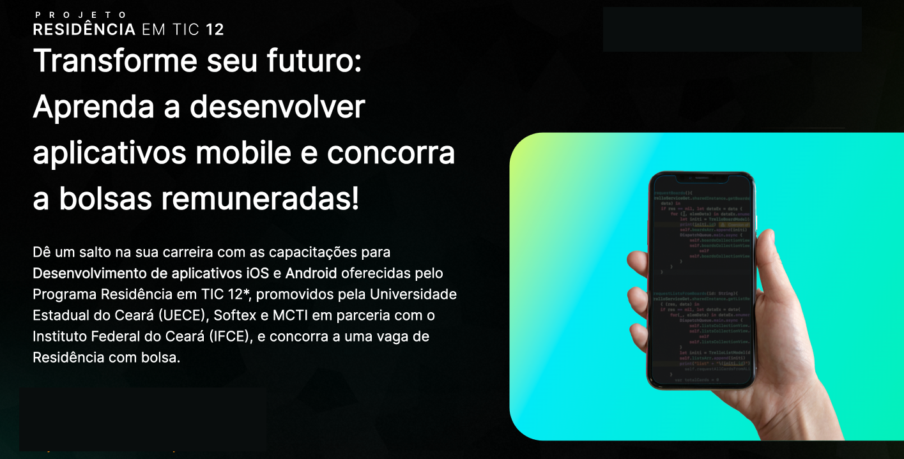
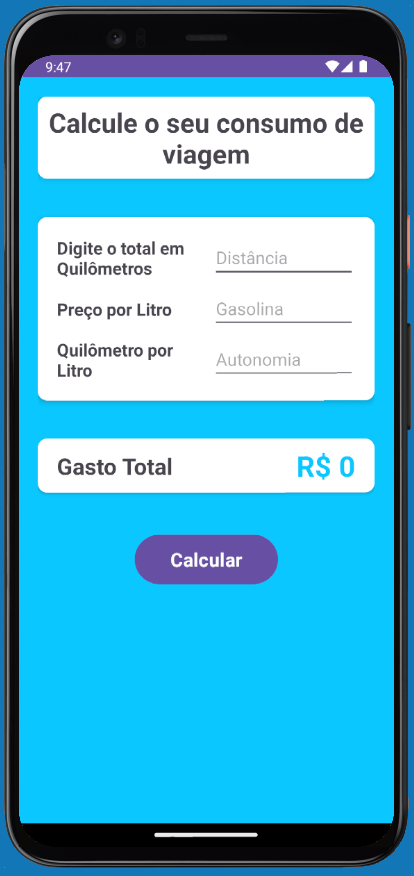
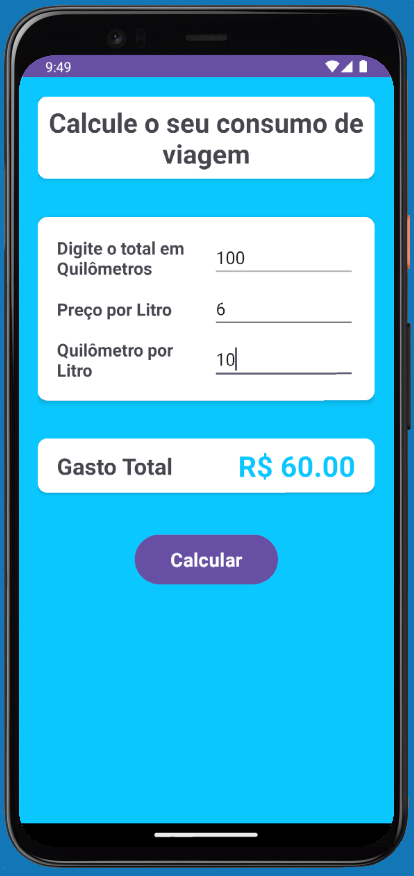
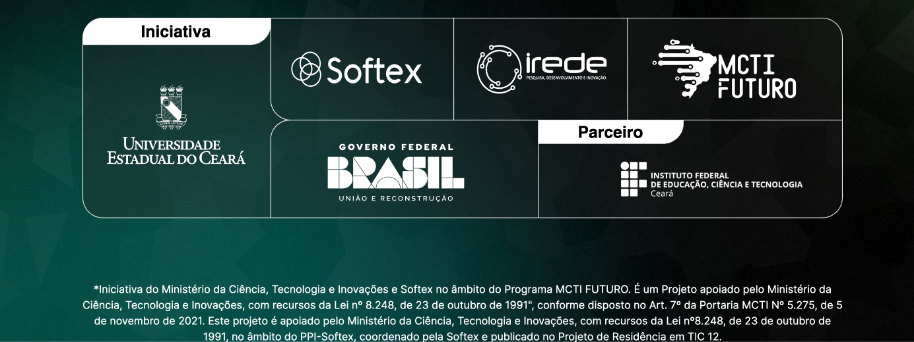

# Travel Consumption

[Read this page in English](./README-en.md)

Esse projeto foi feito com base nas aulas do [Projeto Residência em TIC 12](https://metaclassroom.app.br/#/).

 

## Sobre o curso

Os seguintes tópicos foram abordados durante o curso:

- Controle de fluxo
- Tratamento de dados
- Orientacão a objeto
- Android Studio
- Criacão de layout

## Sobre o projeto

Este é um aplicativo básico projetado para calcular o custo de uma viagem de carro, utilizando três valores essenciais: a distância total a ser percorrida, o preço da gasolina e a autonomia do veículo. Ao inserir esses dados e acionar o botão de cálculo, o aplicativo fornece ao usuário o valor total estimado necessário para a viagem.

  
  

 

